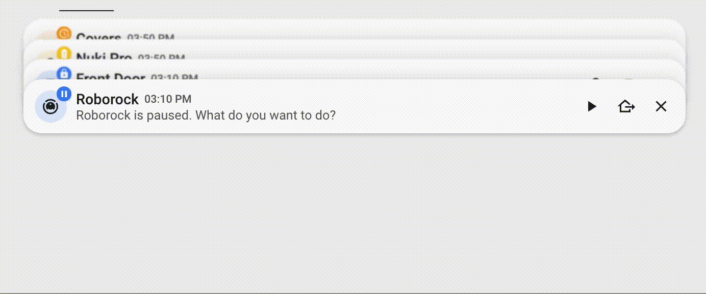
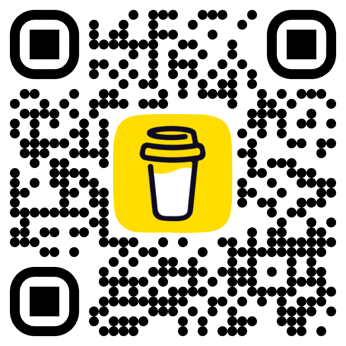

### Home Assistant Custom Button Cards

This repository contains templates for a modern and responsive Home Assistant dashboard.

-----


-----

### Available Cards

#### Stacked Notification Card
Notifications that stack and expand on hover or touch. They support multiple actions and auto-close.



**Features:**
- **Stacking Behavior**: Multiple notifications stack vertically, with only the top one fully visible. Hovering or touching expands all notifications for easy access.
- **Customizable Display**: Includes customizable icon, title, message, and timestamp (shows time if today, date and time otherwise).
- **Badges**: Optional badges on notifications (e.g., warning icons or custom values) for additional context.
- **Multiple Actions**: Each notification can have multiple action buttons (e.g., play, pause, dismiss).
- **Close Button**: Built-in close button to manually dismiss notifications.
- **Responsive Design**: Adapts to different screen sizes with smooth transitions and hover effects.

#### Room Card
A card for controlling multiple devices in a single room, with multiple actions available, configurable badges and more!


**Features:**
- **Room Overview**: Displays room name, icon, current state (e.g., temperature/humidity), and optional sub-state.
- **Customizable Appearance**: Configurable background colors for the card and icon, allowing personalization to match your theme.
- **Action Columns**: Actions are organized in vertical columns, each containing multiple buttons for device control.
- **Flexible Actions**: Supports various tap actions such as toggle, more-info, navigate to other views, or call services.
- **Badge Support**: Actions can have badges indicating status (types: success, info, warning, error, white) with icons or values, and support custom background and text colors for full customization.

-----

### 🚀 Setup 

1.  **Be sure to have `button-card` and `card-mod` installed.** You can get them via HACS.

2.  Copy the content of the `templates` directory and paste it into the top of your Dashboard yaml. You can access this by clicking **Edit dashboard** -\> **three dots** -\> **Raw configuration editor**.

    ⚠️ **WARNING:** Be sure you **do not delete the views key** below the templates. This is basically your dashboard configuration and deleting it will delete your  UI.

    It should look something like this:

    ``` yaml
    button_card_templates:
        room_card_action:
        ...
        room_card:
        ...
        notification_card:
        ...
        notification_card_action:
        ...

    views: ...  
    ```
    -----

### 🧩 Using the Templates

Once you set up the templates, you can create cards that use them.

```yaml
type: custom:button-card
template: room_card
name: Kitchen
```

See the `card_examples` directory for full card configurations.

-----

### 🎨 Themes

If you like how this dashboard looks, you can find the themes I'm using in the `themes` folder.

1.  **Copy the Theme Files**: Copy the theme files (e.g., `minimalist-desktop.yaml`, `minimalist-mobile.yaml`) into a `themes` directory in your Home Assistant `config` folder.

2.  **Update `configuration.yaml`**: Edit your `configuration.yaml` file to enable the themes and point to the directory. Add the following lines:

    ```yaml
    frontend:
      themes: !include_dir_merge_named themes
    ```

3.  **Restart and Select Theme**: After saving `configuration.yaml` and restarting Home Assistant, the new themes will be available in your user profile settings.

-----

### 🙏 Contributing

Feel free to open an issue or submit a pull request if you have ideas for improvements or new templates.

---

### ❤️ Support My Work

If you find these templates useful, you can support my work by buying me a coffe / beer!


<a href="https://www.buymeacoffee.com/polamoros" target="_blank"></a>
<br/><br/>

